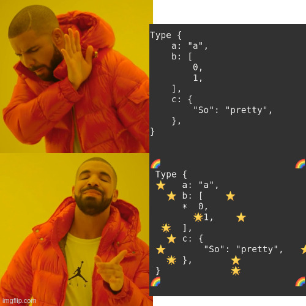

I'm not a fan of the built-in "pretty-print" debug output (format string `"{:#?}"`) because they don't look so pretty to me. That is why I made this crate.

`prettier-print` contains two modules. The first is `prettier_printer` which adds rainbows and stars to the debug string.

`sparkles` prints the debug string, and then runs game of life on top of the printed string.
